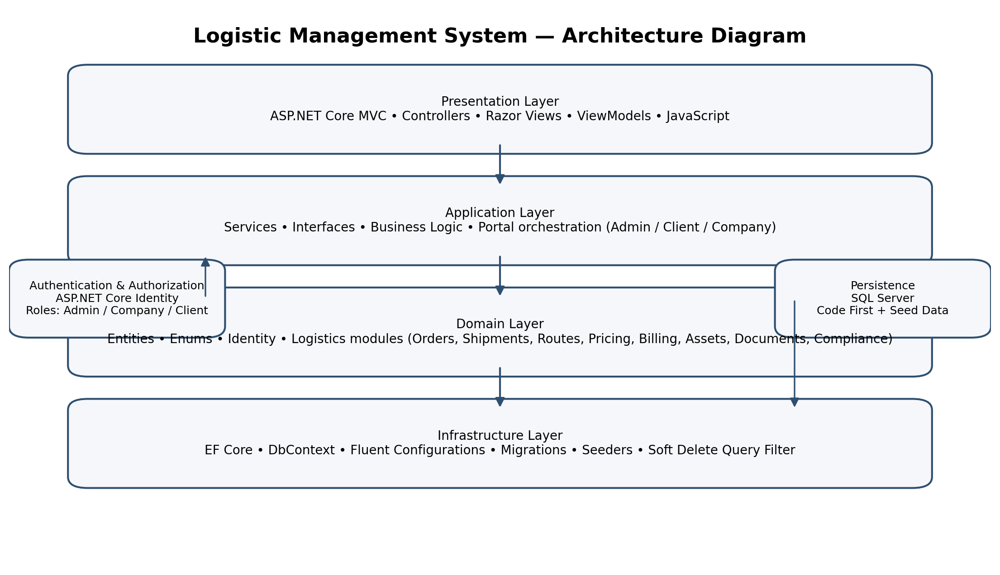
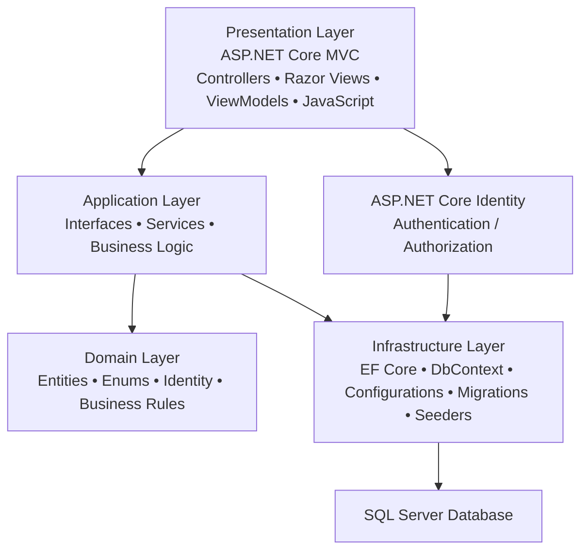
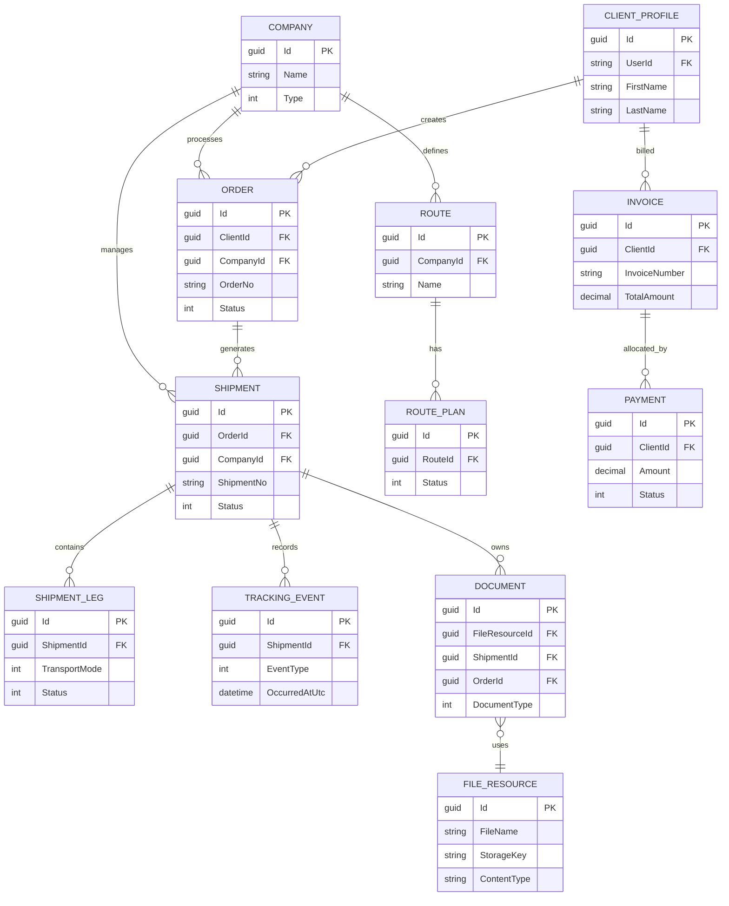

# Logistic Management System

> Професионална документация за дипломна разработка  
> Технологичен стек: **ASP.NET Core MVC (.NET 10)**, **Entity Framework Core 10**, **SQL Server**, **ASP.NET Core Identity**




---

## 1. Обща информация

**Logistic Management System** е много-модулно уеб приложение за управление на логистични процеси, разработено като цялостна информационна система с разделение по роли, бизнес модули и транспортни направления.

Проектът не представлява просто базов CRUD сайт, а обхваща:

- управление на **клиенти**, **логистични компании** и **администратори**
- **поръчки**, **пратки**, **маршрути**, **ценообразуване** и **фактуриране**
- **документи**, **версии на документи**, **compliance проверки**
- активи за **road**, **sea**, **air**, **rail** и **cargo units**
- **tracking** на пратки
- **soft delete**, **audit информация**, **role-based authorization**
- начално **seed-ване** на данни за демонстрация и тестване

Системата е изградена с ясна слоеста архитектура и е подходяща за представяне като дипломна разработка, защото демонстрира реален домейн, богата база данни, различни роли, сложни взаимовръзки и сериозен обем функционалност.

---

## 2. Основни цели на проекта

Проектът има за цел да предостави единна платформа за:

1. регистриране и управление на логистични участници;
2. организиране на пратки и свързаните с тях операции;
3. проследяване на движението на пратки по номер или статус;
4. управление на маршрути, спирки, активи и ресурси;
5. поддръжка на документи и регулаторни проверки;
6. фактуриране, плащания и базово търговско/ценово моделиране;
7. административен контрол върху данните в системата.

---

## 3. Архитектура

### 3.1 Архитектурен стил

Приложението е реализирано със **слоеста архитектура**, близка до **Clean / Onion Architecture** по идея:

- **Presentation Layer** – Controllers, Razor Views, ViewModels, клиентско UI поведение
- **Application Layer** – Interfaces и Services с бизнес логика
- **Domain Layer** – Entities, Enums и основни бизнес модели
- **Infrastructure Layer** – EF Core, DbContext, Fluent API конфигурации, migrations и seed данни

### 3.2 Архитектурна диаграма (Mermaid)



### 3.3 Реална структура на проекта

```text
LogisticManagementApp/
├─ Application/
│  ├─ Interfaces/
│  └─ Services/
├─ Controllers/
├─ Domain/
│  ├─ Assets/
│  ├─ Billing/
│  ├─ Clients/
│  ├─ Companies/
│  ├─ Compliance/
│  ├─ Documents/
│  ├─ Identity/
│  ├─ Locations/
│  ├─ Operations/
│  ├─ Orders/
│  ├─ Pricing/
│  ├─ Routes/
│  ├─ Security/
│  └─ Shipments/
├─ Infrastructure/
│  └─ Persistence/
│     ├─ Configurations/
│     ├─ Extensions/
│     ├─ Migrations/
│     └─ Seed/
├─ Models/
├─ Views/
├─ wwwroot/
├─ Program.cs
└─ appsettings.json
```

---

## 4. Технологии и инструменти

### Backend
- **ASP.NET Core MVC**
- **.NET 10**
- **Entity Framework Core 10**
- **ASP.NET Core Identity**
- **SQL Server**

### Frontend
- **Razor Views (.cshtml)**
- **HTML / CSS / Bootstrap**
- **JavaScript**

### Persistence и Data Access
- **Code First**
- **Fluent API configurations**
- **Migrations**
- **Seed data**

### Deployment / DevOps
- **Dockerfile**
- възможност за deployment към **Azure App Service + Azure SQL**

---

## 5. Реален обхват на проекта

След обход на кода проектът включва приблизително:

- **15 controller файла**
- **531 action метода**
- **297 view файла**
- **100+ EF Core конфигурации**
- **100+ seed модула**
- **170+ domain файла**
- **65 enum типа**

Това показва, че системата е значително по-голяма от типичен курсов CRUD проект.

---

## 6. Потребителски роли и достъп

### 6.1 Admin
Администраторът има достъп до административна част за управление на данните в системата.  
Реализирани са страници за:

- преглед на entity категории
- listing на записи
- детайли
- създаване
- редакция
- изтриване / soft delete
- възстановяване чрез промяна на `IsDeleted`

### 6.2 Company
Фирменият портал е най-богатата част от приложението и включва:

- company profile
- branches
- contacts / capabilities
- addresses / locations / warehouses / terminals / docks
- routes / route stops / route plans
- документи и версии
- compliance данни
- notifications / subscriptions
- dashboard configurations
- активи по транспортен тип:
  - **Sea** – vessels, voyages, vessel positions, crew
  - **Road** – vehicles, drivers, trips, trip stops
  - **Air** – aircraft, flights, flight segments, air crew, ULD
  - **Rail** – trains, rail cars, rail services, rail movements
  - **Cargo Units** – containers, seals

### 6.3 Client
Клиентският портал включва:

- dashboard
- мои поръчки
- мои пратки
- мои адреси
- създаване / редакция / изтриване на адреси
- задаване на default адрес
- tracking на конкретна пратка

### 6.4 Public / Anonymous
Публичната начална страница позволява:

- преглед на начална информация
- търсене на пратка по **tracking number**, без вход в системата

---

## 7. Автентикация и сигурност

### 7.1 Identity
Проектът използва **ASP.NET Core Identity** с потребители и роли:

- `Admin`
- `Company`
- `Client`

### 7.2 Настройки за сигурност
В `Program.cs` са дефинирани реални настройки за сигурност:

- уникален email
- парола с:
  - малка буква
  - главна буква
  - цифра
  - специален символ
  - минимална дължина
- lockout при неуспешни опити
- cookie-based authentication
- access denied страница
- anti-forgery token защита при POST форми
- role-based authorization през `[Authorize(Roles = "...")]`

### 7.3 Session tracking
След успешен login се създава запис в `UserSession`, включващ:

- user id
- session token
- IP адрес
- user agent
- статус на сесията
- timestamps

### 7.4 Soft delete и audit
Всички entity-та, наследяващи `BaseEntity`, поддържат:

- `CreatedAtUtc`
- `UpdatedAtUtc`
- `IsDeleted`
- `DeletedAtUtc`

При изтриване EF Core не премахва реда физически, а:

- маркира `IsDeleted = true`
- попълва `DeletedAtUtc`
- обновява `UpdatedAtUtc`

Допълнително има **global query filter**, който автоматично изключва изтрити записи от стандартните заявки.

---

## 8. Домейн модел и бизнес модули

### 8.1 Компании
Основни класове:
- `Company`
- `CompanyBranch`
- `CompanyContact`
- `CompanyCapability`

### 8.2 Клиенти
Основни класове:
- `ClientProfile`
- `ClientAddress`

### 8.3 Поръчки
Основни класове:
- `Order`
- `OrderLine`
- `OrderAttachment`
- `OrderStatusHistory`

### 8.4 Пратки
Основни класове:
- `Shipment`
- `ShipmentLeg`
- `ShipmentParty`
- `ShipmentReference`
- `ShipmentStatusHistory`
- `TrackingEvent`
- `Package`
- `CargoItem`
- `ProofOfDelivery`

### 8.5 Маршрути
Основни класове:
- `Route`
- `RouteStop`
- `RoutePlan`
- `RoutePlanStop`
- `RoutePlanShipment`

### 8.6 Документи
Основни класове:
- `FileResource`
- `Document`
- `DocumentVersion`
- `DocumentTemplate`

### 8.7 Compliance
Основни класове:
- `ComplianceCheck`
- `DangerousGoodsDeclaration`
- `DGDocument`
- `TemperatureRequirement`

### 8.8 Pricing
Основни класове:
- `ServiceLevel`
- `GeoZone`
- `Tariff`
- `TariffRate`
- `Surcharge`
- `Agreement`
- `DiscountRule`
- `PricingQuote`
- `PricingQuoteLine`

### 8.9 Billing
Основни класове:
- `Charge`
- `Invoice`
- `InvoiceLine`
- `Payment`
- `PaymentAllocation`
- `CreditNote`
- `TaxRate`

### 8.10 Операции и планиране
Основни класове:
- `Booking`
- `BookingLeg`
- `Consolidation`
- `Assignment`
- `ResourceCalendar`
- `ResourceAvailability`
- `CapacityReservation`
- `UtilizationSnapshot`
- `Notification`
- `AuditLog`
- `SavedFilter`
- `CompanyDashboardConfig`

### 8.11 Активи по транспорт
Проектът моделира активи за различни транспортни модалности:

- **Sea** – `Vessel`, `Voyage`, `VoyageStop`, `VesselPosition`, `CrewAssignment`
- **Road** – `Vehicle`, `Driver`, `Trip`, `TripStop`, `TripShipment`
- **Air** – `Aircraft`, `Flight`, `FlightSegment`, `AirCrewMember`, `AirCrewAssignment`, `ULD`
- **Rail** – `Train`, `RailCar`, `RailService`, `RailMovement`
- **Cargo Units** – `Container`, `ContainerSeal`

---

## 9. ER диаграма на базата

Пълната физическа схема е много голяма, затова за README е по-подходящо да се покаже **домейн-ориентирана ER диаграма**, която представя основните бизнес зависимости.

### 9.1 ER диаграма (Mermaid)



### 9.2 Как да обясниш ER диаграмата на защита

При представяне можеш да кажеш следното:

- **Company** е централният бизнес участник от страна на логистичния оператор.
- **ClientProfile** моделира клиента и стои в началото на клиентските заявки.
- **Order** представлява заявка от клиент към фирма.
- От една поръчка могат да възникнат една или повече **Shipment** единици.
- Всяка пратка съдържа етапи (**ShipmentLeg**) и история на проследяване (**TrackingEvent**).
- Документите са отделени от файловите ресурси, което позволява версия на документ и повторно използване на файлов метаданни.
- **Route** и **RoutePlan** позволяват планиране и оптимизиране на изпълнението.
- **Invoice** и **Payment** оформят търговската и финансовата страна на процеса.

---

## 10. Persistence слой

### 10.1 DbContext
Централният клас е:

- `LogisticAppDbContext`

Той съдържа `DbSet<>` за:

- компании
- клиенти
- локации
- поръчки
- пратки
- pricing
- billing
- documents
- compliance
- assets
- operations
- routes
- user sessions
- identity integration

### 10.2 Fluent API
Конфигурациите са разделени по папки и домейни, което подобрява:

- четимост
- поддръжка
- мащабируемост
- контрол върху релации, constraints и precision

### 10.3 Migrations
Проектът използва Code First migration:

- `20260417191418_Initial`

### 10.4 Seed данни
Системата съдържа обширен `SeedRunner`, който създава последователно:

- роли
- локации
- компании
- потребители
- клиентски профили
- master data
- транспортни активи
- маршрути
- поръчки
- пратки
- документи
- compliance
- billing
- operations

Това е силен плюс за дипломна защита, защото показва, че приложението може да бъде демонстрирано с реалистични данни веднага след стартиране.

---

## 11. Навигация и UI

### 11.1 Начална страница
Началната страница изпълнява две роли:

- landing page
- публичен shipment tracking вход

### 11.2 Role-based navigation
След логин потребителят се пренасочва според ролята си:

- **Admin** → Admin Dashboard
- **Company** → Company portal
- **Client** → Client Dashboard

### 11.3 Portal-based UX
Системата е организирана в три основни UI потока:

- публична част
- клиентски портал
- фирмен портал
- административен панел

Това прави приложението по-ясно, по-реалистично и по-удобно за представяне.

---

## 12. Стартиране на проекта

### 12.1 Изисквания
- Visual Studio 2022 / Rider / VS Code + C# tooling
- .NET SDK 10
- SQL Server / SQL Server Express

### 12.2 Конфигурация
В `appsettings.json` е дефиниран connection string:

```json
"ConnectionStrings": {
  "DefaultConnection": "Server=...;Database=LogisticManagementApp;Trusted_Connection=True;MultipleActiveResultSets=true;TrustServerCertificate=True"
}
```

### 12.3 Стъпки
1. Clone на repository-то
2. Настройване на connection string
3. Прилагане на migrations
4. Стартиране на приложението
5. Автоматично seed-ване на началните данни при startup

### 12.4 Команди
```bash
dotnet restore
dotnet ef database update
dotnet run
```

---

## 13. Демонстрационни акаунти

В seed логиката присъстват предварително създадени потребители.

### Administrator
- Email: `admin@logisticapp.com`
- Username: `admin`
- Password: `Admin123!`

### Company users
За фирмите се генерират потребители по шаблон:
- Email: `<normalizedcompanyname>@company.logisticapp.com`
- Username: `company_<normalizedcompanyname>`
- Password: `Company123!`

### Client users
Клиентски профили също се seed-ват с потребители на база seed логиката.

> Забележка: За production deployment тези акаунти и пароли трябва да се заменят с по-сигурен onboarding процес.

---

## 14. Аргументация по критерии за **30/30**

Тази секция е написана така, че да може да се използва директно в дипломна документация или при защита.

### 14.1 Functionality — защо проектът е силен
Проектът покрива широк и реалистичен бизнес сценарий:

- не е еднотипен CRUD, а **много-модулна логистична система**
- има **3 различни роли** с различни права и UI потоци
- включва **orders**, **shipments**, **routes**, **pricing**, **billing**, **documents**, **compliance**, **assets**
- има **public tracking**, което е реална потребителска функционалност
- има **seed данни** за пълна демонстрация
- моделира **четири транспортни направления** + cargo units

**Как да го представиш:**  
„Проектът решава реален логистичен проблем и обхваща целия жизнен цикъл – от клиентска заявка и поръчка, през пратка и маршрут, до документи, compliance и фактуриране.“

### 14.2 Controllers / Views — защо проектът е силен
- много на брой controllers и actions
- отделни портали за различни типове потребители
- ясна навигация
- богата Razor View структура
- форми за create / edit / delete / detail / list сценарии
- специализирани страници по модули

**Как да го представиш:**  
„UI слоят не е просто няколко страници, а пълна навигационна система с отделни бизнес портали и десетки екрани за различни операции.“

### 14.3 Database / Data Model — защо проектът е силен
- голям и добре разделен домейн модел
- много entity типове
- Fluent API конфигурации
- migration-based създаване на schema
- богат set от взаимовръзки
- seed данни

**Как да го представиш:**  
„Базата е проектирана като нормализиран модел с отделни бизнес области, като е запазена ясна връзка между поръчки, пратки, маршрути, документи и финансови операции.“

### 14.4 Security — как да изкараш максимума
Проектът **вече съдържа реални механизми за сигурност**:

- ASP.NET Core Identity
- роли и authorization
- password policy
- lockout policy
- anti-forgery validation
- session logging
- access denied handling
- cookie configuration
- unique email constraint

**Как да го представиш:**  
„Сигурността не е формална – системата има истинска автентикация, ролеви достъп, cookie настройки, защита при POST операции и проследяване на потребителски сесии.“

### 14.5 Architecture / Code Quality — как да изкараш максимума
- слоеста архитектура
- service abstraction чрез interfaces
- отделяне на UI, бизнес логика, домейн и persistence
- отделни конфигурации и seeders
- мащабируем модулен дизайн

**Как да го представиш:**  
„Структурата позволява лесно разширяване и поддръжка, защото логиката не е смесена във views или controllers, а е разпределена в отделни слоеве.“

### 14.6 Как practically да защитиш **30/30**
На защита акцентирай върху следното:

1. **Реален бизнес проблем** – логистика с множество подсистеми.
2. **Сложен домейн модел** – не просто Users + Products.
3. **Роли и различни портали** – Admin / Company / Client.
4. **Persistence дълбочина** – migration, fluent config, seed, soft delete.
5. **Security** – Identity, role-based authorization, lockout, antiforgery.
6. **Мащабируемост** – архитектурата позволява да се добавят нови модули.
7. **Демонстрация с данни** – проектът може да се покаже веднага след стартиране.

---

## 15. Силни страни на проекта

- много добър домейн обхват
- богата база данни
- ясна архитектура
- реална сигурност, а не фиктивна login форма
- отделни бизнес портали
- подготвен за демонстрация със seed данни
- наличие на Dockerfile
- готовност за cloud deployment

---

## 16. Какво още може да се подобри

За пълнота и още по-силен production профил, в бъдеще може да се добавят:

- automated unit tests / integration tests
- по-подробно audit trail за всички административни промени
- file storage abstraction (например Azure Blob Storage)
- export функции (PDF / Excel)
- API layer за външни интеграции
- dashboard analytics и KPI визуализации
- CI/CD pipeline

> Тази секция е полезна на защита, защото показва, че разбираш както силните страни, така и следващите стъпки за развитие.

---

## 17. Deployment

Проектът може да бъде хостван в production среда чрез:

- **Azure App Service**
- **Azure SQL Database**
- или стандартен Windows/Linux hosting с SQL Server

Основни стъпки:
1. публикуване на приложението;
2. конфигуриране на connection string;
3. изпълнение на migration;
4. първоначално seed-ване;
5. защита на production credentials.

---

## 18. Заключение

**Logistic Management System** е сериозен, многослоен и добре структуриран уеб проект, който демонстрира:

- работа с голям домейн модел;
- ролево-ориентирана архитектура;
- реална бизнес логика;
- професионална организация на кода;
- persistence слой с EF Core и SQL Server;
- добри практики за сигурност и поддръжка.

Като дипломна разработка проектът има силен потенциал за **много висока оценка**, защото съчетава:
- реален бизнес казус,
- мащаб на имплементация,
- добра архитектура,
- богата база данни,
- завършен потребителски интерфейс,
- и възможност за убедителна демонстрация.

---

## 19. Автор

Разработено като дипломна / учебна разработка по софтуерни технологии и уеб приложения.

