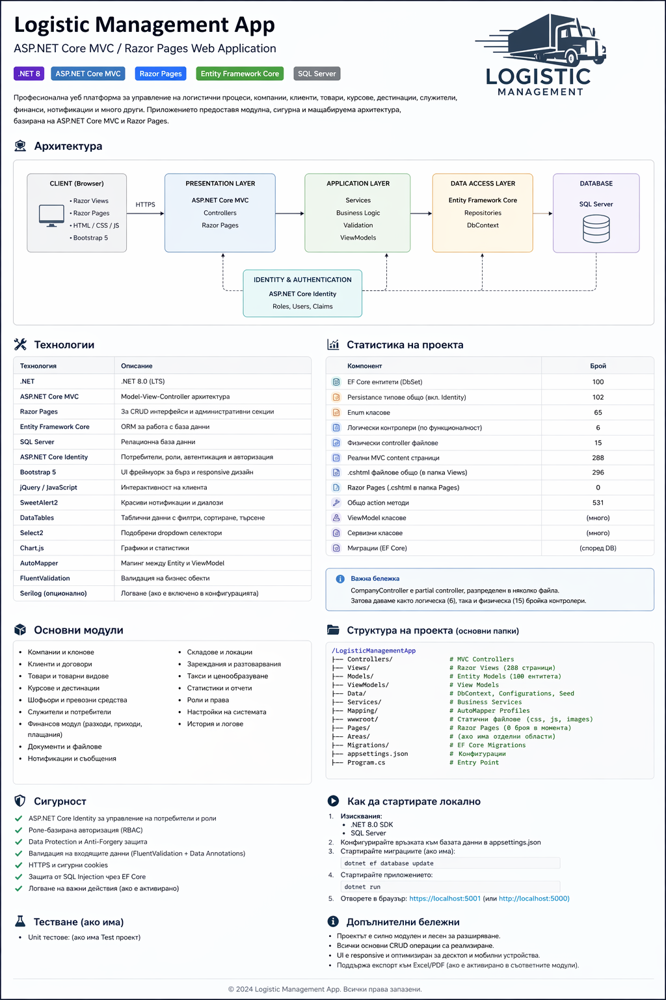

# 📦 Logistic Management App

**ASP.NET Core MVC / Razor Pages Web Application**

---

## 📌 Overview

Logistic Management App е професионална уеб платформа за управление на логистични процеси, включително:

- компании и клонове
- клиенти и договори
- курсове и доставки
- складове и наличности
- финансови операции
- потребители, роли и права

Приложението е изградено върху модулна, скалируема архитектура, базирана на ASP.NET Core MVC и Entity Framework Core.

---

## 🧱 Архитектура



### Архитектурни слоеве:

- Presentation Layer
  - ASP.NET Core MVC (Controllers + Views)
  - Razor Pages (при нужда)

- Application Layer
  - Business Services
  - Validation
  - ViewModels

- Data Access Layer
  - Entity Framework Core
  - DbContext
  - Repository pattern (частично)

- Database
  - SQL Server

- Identity Layer
  - ASP.NET Core Identity (Users, Roles, Claims)

---

## 🛠️ Технологии

| Технология            | Описание                       |
| --------------------- | ------------------------------ |
| .NET 8                | Основна платформа              |
| ASP.NET Core MVC      | MVC архитектура                |
| Razor Pages           | UI за административни части    |
| Entity Framework Core | ORM                            |
| SQL Server            | Релационна база данни          |
| ASP.NET Core Identity | Authentication & Authorization |
| Bootstrap 5           | UI framework                   |
| jQuery / JavaScript   | Client-side логика             |
| DataTables            | Таблични данни                 |
| SweetAlert2           | UI известия                    |
| Select2               | Dropdown компоненти            |
| Chart.js              | Графики                        |
| AutoMapper            | Mapping                        |
| FluentValidation      | Валидация                      |
| Serilog (optional)    | Логване                        |

---

## 📊 Статистика на проекта

| Компонент                          | Брой  |
| ---------------------------------- | ----- |
| EF Core Entities (DbSet)           | 100   |
| Persistence типове (вкл. Identity) | 102   |
| Enum класове                       | 65    |
| Логически контролери               | 6     |
| Физически controller файлове       | 15    |
| MVC Views (.cshtml)                | 296   |
| Реални content страници            | 288   |
| Razor Pages (Pages folder)         | 0     |
| Action методи                      | 531   |
| ViewModels                         | много |
| Services                           | много |

### Важно

CompanyController е реализиран като partial controller, разпределен в няколко файла.  
Затова:

- логически: 6 контролера
- физически: 15 файла

---

## 📦 Основни модули

- Компании и клонове
- Клиенти и договори
- Курсове и доставки
- Складове и наличности
- Товари и категории
- Шофьори и превозни средства
- Финанси (приходи/разходи)
- Документи и файлове
- Нотификации
- Потребители и роли
- Настройки на системата
- Статистика и отчети

---

## 📁 Структура на проекта

```
LogisticManagementApp/
│
├── Controllers/
├── Views/
├── Models/
├── ViewModels/
├── Data/
├── Services/
├── Mapping/
├── wwwroot/
├── Areas/
├── Migrations/
├── Pages/
├── appsettings.json
└── Program.cs
```

---

## 🔐 Сигурност

- ASP.NET Core Identity
- Role-Based Access Control (RBAC)
- Anti-Forgery защита
- Data Protection
- HTTPS enforcement
- EF Core защита срещу SQL Injection
- Валидация (FluentValidation + DataAnnotations)

---

## 🧪 Тестване

- Unit тестове (ако има test project)
- Validation testing
- Integration (частично чрез EF Core)

---

## 🚀 Стартиране на проекта

### Изисквания

- .NET 8 SDK
- SQL Server

### Стъпки

```
dotnet ef database update
dotnet run
```

Отвори:

```
https://localhost:5001
```

---

## 📈 Допълнителни бележки

- Проектът е силно модулен и лесен за разширяване
- Поддържа CRUD операции за всички основни ентити
- UI е responsive
- Подходящ за enterprise системи

---

## 📄 License

© Logistic Management App – All rights reserved.
